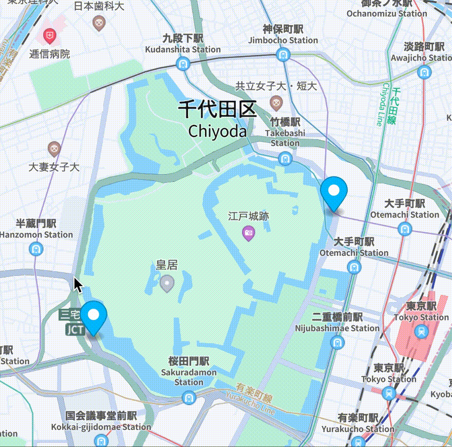
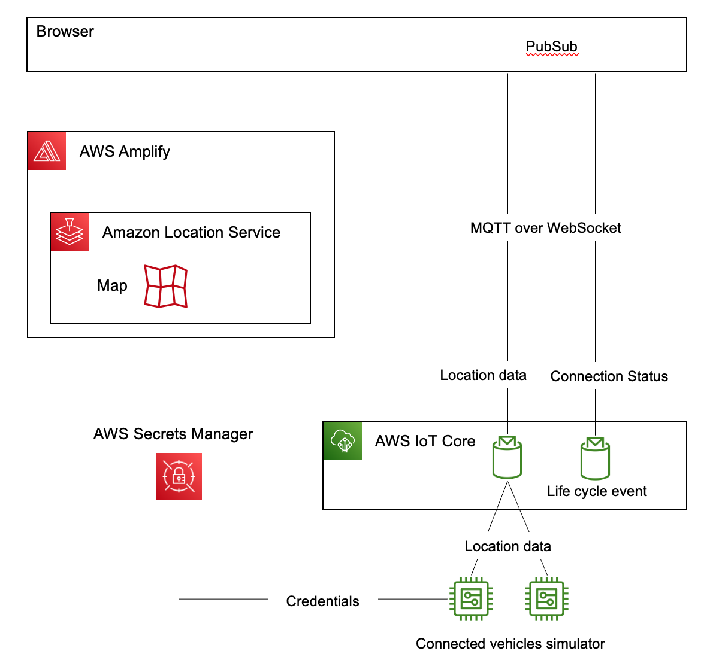

# Mobility tracking with Amazon Location Service, Amplify PubSub and IoT Core Life Cycle Event

This sample code demonstrates real-time mobility tracking on a map using Amazon Location Service, AWS IoT Core, Amplify and its PubSub library. It displays latitude and longitude, while utilizing IoT Core's lifecycle events to show connection information in pop-ups. The front-end framework utilized is React.

While this sample focuses solely on real-time visualization, it's worth noting that Fan-out with MQTT allows for simultaneous multi-tasking capabilities. This means you can concurrently perform real-time visualization while also storing the same data for tracking and historical archiving in databases. 

# Demo video



It displays vehicle positions and connectivity status, with blue indicating connected and red indicating disconnected. Detailed information is provided in the pop-up.

# Overview architecture




# Installation

```
git clone git@github.com:aws-samples/mobility-tracking-with-amazon-location-service-and-amplify-pubsub.git
cd mobility-tracking-with-amazon-location-service-and-amplify-pubsub
npm ci
```

If you haven't already, install Amplify by following the instructions on [this page](https://docs.amplify.aws/cli/start/install/).

```
amplify init

? Enter a name for the project maplibrejsreactiotas
? Initialize the project with the above configuration? Yes
? Select the authentication method you want to use: AWS profile
? Please choose the profile you want to use default
✔ Help improve Amplify CLI by sharing non sensitive configurations on failures (y/N) · yes
```

```
amplify add geo

? Select which capability you want to add: Map (visualize the geospatial data)
✔ geo category resources require auth (Amazon Cognito). Do you want to add auth now? (Y/n) · yes
 Do you want to use the default authentication and security configuration? Default configuration
 Warning: you will not be able to edit these selections.
 How do you want users to be able to sign in? Username
 Do you want to configure advanced settings? No, I am done.
✔ Provide a name for the Map: · map99f11af4
✔ Who can access this Map? · Authorized and Guest users
✔ Do you want to configure advanced settings? (y/N) · no
```

Make sure to select **Authorized and Guest users**

Add policy to the Cognito unauthRole:

```
amplify override project

✔ Do you want to edit override.ts file now? (Y/n) · no

cp etc/override.ts amplify/backend/awscloudformation/override.ts
```

```
amplify push

✔ Are you sure you want to continue? (Y/n) · yes
```

Deploy IoT Core and Lambda resource:

```
npm run cdk deploy

:

Do you wish to deploy these changes (y/n)? y

```

# Run app

Update `<IOT_CORE_ENDPOINT>` in `src/App.jsx` and then run following command.

```
npm start
```

Update `REGION` in`simulator.ts` to specify the region where your credentials are located and then run following command. The simulator retrieves the IoT Core endpoint based on the AWS CLI profile and sends location data to that endpoint.

```
npm run sim
```

# Clean up

```
npm run cdk destroy
```

```
amplify delete
```

# Troubleshooting

If you don't see the marker on the map moving, you can check the following:

1. [View MQTT messages with the AWS IoT MQTT client](https://docs.aws.amazon.com/iot/latest/developerguide/view-mqtt-messages.html)
2. Check IoT Core logs with `aws logs tail --follow AWSIotLogsV2`
3. Check browser's developper console. 

